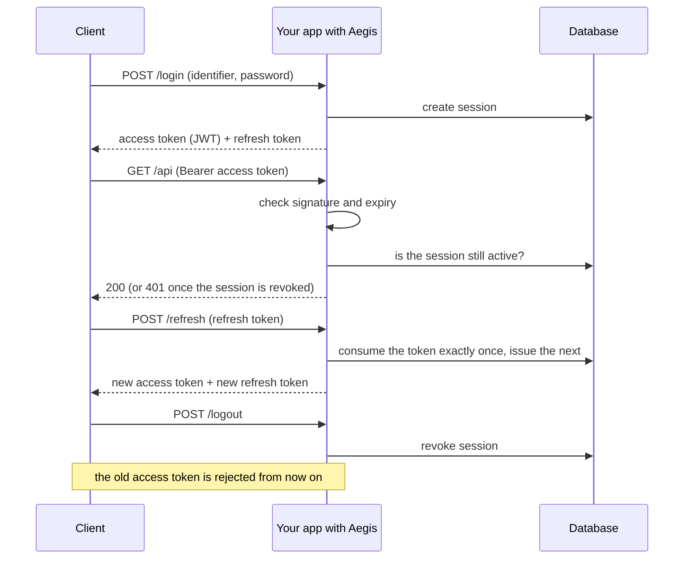
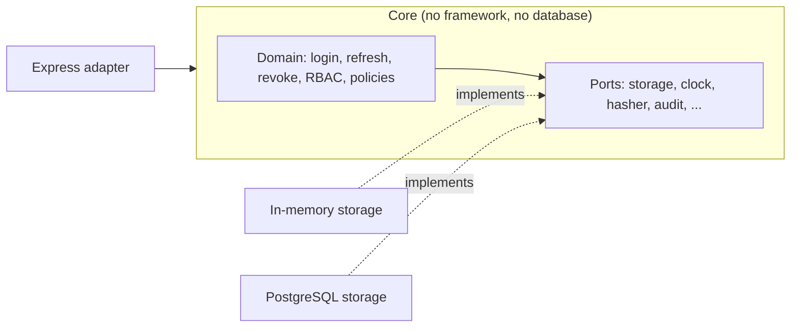

# Aegis

**Authentication and authorization for Node.js: sessions, JWT, RBAC and policies behind small, swappable adapters.**

[](https://github.com/RudraMistry-cmd/Aegis/actions/workflows/ci.yml)
[](LICENSE)
[](https://nodejs.org)
[](tsconfig.json)

## What it is

Aegis is a reusable login-and-permissions layer you add to an application instead of rebuilding it
each time. It handles registering and signing in users, issuing and refreshing tokens, ending
sessions, and deciding who may do what. The core is plain TypeScript with no framework and no
database; storage and HTTP are adapters you plug in. It is built from a written specification
([`spec/`](spec/)), and test suites check the code against it, including races between parallel
requests.

## Features

- **Password login** with enumeration-safe responses (the same answer whether or not an account exists) and failed-attempt throttling
- **JWT access tokens** (RS256 or HS256) with `kid`-based **key rotation** and a **JWKS** endpoint; private signing keys are sealed with a master key when stored
- **Rotating refresh tokens** with reuse detection: replaying a spent token revokes the whole session
- **Strict per-request revocation**: a token's signature is never enough; the session is checked on every request, so logout and revocation take effect immediately
- **RBAC** with role inheritance, **policy-based authorization** (for example "only the author may edit") and **query scopes** for filtering lists
- **In-memory and PostgreSQL storage**, the latter safe under concurrent requests (ordered row locks, one-time refresh-token consumption, enforced session limits)
- **Express adapter**: `authenticate()` and `authorize()` middleware, ready-made login/refresh/logout routes, safe JSON errors
- **Audit events** for security-relevant actions, and opt-in **Prometheus metrics**
- **370+ tests**, including 13 concurrency scenarios run against a real PostgreSQL

## How it works



## Architecture



The core only knows the port interfaces. Adapters sit outside it: you can swap storage or add a
web framework without touching the domain.

## Quick start

Requires Node.js 22 or newer.

```bash
git clone https://github.com/RudraMistry-cmd/Aegis.git
cd Aegis
npm install
npm test                  # builds, then runs the unit, conformance and Express tests (a few seconds)
npm run start-notes-app   # then open http://localhost:3000
```

`start-notes-app` runs a small example app (Express, in-memory storage) with a one-page UI. Sign in
as `alice@example.com`, `carol@example.com` or `bob@example.com` with the password
`demo-password-123`. Bob is read-only; Carol cannot delete Alice's notes. The step-by-step
integration guide is in [`examples/notes-app/README.md`](examples/notes-app/README.md).

Other commands:

| Command | What it does |
|---|---|
| `npm run test:pg` | PostgreSQL suite (127 tests). Starts a throwaway PostgreSQL itself, or uses `AEGIS_PG_URL`. |
| `npm run start-demo` | Console walk-through: register, login, authorize, refresh, replay detection, logout, audit trail |
| `npm run lint` | ESLint plus a Prettier check |

## Using it

```ts
import {
  createAuth, createMemoryStorage, defineCatalog, definePolicy,
  createJwtAccessTokens, ScryptHasher, SystemClock, CryptoRandom, CryptoIdGenerator,
} from 'aegis-core';

const catalog = defineCatalog({
  permissions: ['post:read', 'post:update'],
  features: { hierarchy: true },
  roles: {
    reader: { permissions: ['post:read'] },
    author: { inherits: ['reader'], permissions: ['post:update'] },
  },
});

const postPolicy = definePolicy({
  name: 'post-ownership',
  resource: 'post',
  rules: { update: ({ subject, resource }) => resource.authorId === subject.id },
  scope: { update: ({ subject }) => ({ op: 'eq', field: 'authorId', value: subject.id }) },
});

const ids = new CryptoIdGenerator();
const clock = new SystemClock();
// RS256 JWT access tokens; private keys come from your secret manager.
const { accessTokens, keys } = createJwtAccessTokens(
  {
    tokens: { algorithm: 'RS256', issuer: 'my-api', audience: 'my-api', ttl: 10 * 60_000 },
    keys: { rotationEnabled: true },
  },
  { keys: [{ kid: '2026-10', privateKey: process.env.JWT_PRIVATE_KEY_PEM! }], clock, ids },
);
const auth = createAuth({
  storage: createMemoryStorage(),
  hasher: new ScryptHasher(),
  accessTokens,
  clock, random: new CryptoRandom(), ids,
  catalog, policies: [postPolicy],
});

await auth.authn.register({ identifier: 'ada@example.com', password: 'a-long-enough-password' });
const { principal, credentials } = await auth.authn.login({
  identifier: 'ada@example.com', password: 'a-long-enough-password',
});

await auth.authz.can(principal, 'update', { type: 'post', authorId: principal.id }); // true
await auth.authz.assert(principal, 'update', somePost);                              // throws FORBIDDEN
const scope = await auth.authz.authorizeScope(principal, 'update', 'post');           // filter for lists

const rotated = await auth.authn.refresh({ refreshToken: credentials.refreshToken });
await auth.authn.logout({ principal });

// Per request: a valid JWT is necessary but never sufficient — the session decides.
const caller = await auth.authn.authenticate(bearerToken); // or resolve() → Principal | null
```

Every public call takes an explicit `Subject` or `Principal` — there is no ambient "current user".
Authorization decisions are values (`authorize`, `can`); only `assert` throws.

**Production settings.** Passwords are hashed with scrypt at a strong default cost (N = 2^17).
Login identifiers appear in rate-limit keys and audit events only as an HMAC under a secret: set
`AEGIS_IDENTIFIER_DIGEST_KEY` (or the `identifierDigestKey` option; `openssl rand -hex 32`). When
`NODE_ENV=production`, Aegis refuses to start without it.

### Express

```ts
import { authenticate, authorize, createExpressApp } from 'aegis-core/express';

app.get('/posts', authenticate(auth), authorize(auth, 'post:read'), handler); // req.principal is set
const demo = createExpressApp({ auth, jwks }); // POST /login /refresh /logout, GET /me, JWKS
```

A transport layer only: `authenticate()` hands the Bearer token (or an opt-in cookie) to
`auth.authn.authenticate`, so every request is checked against the session store; nothing is
decoded or cached in the adapter. Errors become fixed JSON bodies without internal causes. Express 5
is an optional peer dependency, loaded only from `aegis-core/express`.

### PostgreSQL, durable keys and JWKS

```ts
import { createPostgresStorage, PostgresAuditSink } from 'aegis-core/postgres';

const storage = createPostgresStorage({ connectionString: process.env.DATABASE_URL! });
await storage.migrate(); // applies migrations/*.sql once each; safe on every start

const { accessTokens, keys, jwks } = await openJwtAccessTokens(
  { tokens: { algorithm: 'RS256', issuer, audience, ttl: 900_000 },
    keys: { rotationEnabled: true, storage: 'postgres', generateIfMissing: true, jwks: {} } },
  { keyStore: storage.keys, clock: new SystemClock(), ids: new CryptoIdGenerator() },
);
const auth = createAuth({ storage, audit: new PostgresAuditSink(storage.client), accessTokens, /* … */ });
// serve jwks.handle() at jwks.path (/.well-known/jwks.json)
```

Signing keys live in the key store, with private halves sealed under `AEGIS_MASTER_KEY` (required
for PostgreSQL). Every instance loads the same keyring, so tokens verify across restarts and
instances; rotation is stage → activate. Startup fails with `CONFIG_INVALID` rather than run without
a usable active key. Point `connectionString` at the primary, not a read replica.

## Status: v1.0.0 — Phase 1 complete

Phase 1 is finished: the core domain, PostgreSQL storage, JWT tokens with key rotation and JWKS,
the Express adapter, and a staging stack (Docker Compose, CI, Prometheus). The specification is the
contract, and the test suites check the code against it.

### Not included / Roadmap

These are outside Phase 1, not unfinished work. Each is marked in the source with an
"Out of scope for Phase 1" note naming the spec section it would implement.

- **Multi-factor authentication** and other additional login factors
- **Password reset and e-mail verification** (they need a mail/notification port)
- **A shared rate limiter** for several instances; the bundled limiter lives in one process
- **Cleanup of expired tokens and sessions**: expiry is always checked when rows are read, so
  correctness does not depend on deletion; the PostgreSQL adapter offers `storage.housekeep(cutoff)`
  to schedule yourself
- **A FastAPI (Python) adapter**; Express is the only HTTP adapter
- **Scoped role assignments** (per tenant or project); roles are global

Also not included: databases other than PostgreSQL, runtime-defined roles, OAuth/OIDC, passkeys,
API keys, a password pepper, and secret-manager or HSM connectors (options are documented in
[`docs/JWKS.md`](docs/JWKS.md) and [`docs/SECRETS.md`](docs/SECRETS.md)).

## Documentation

| Read | For |
|---|---|
| [`spec/`](spec/) | The normative specification: authentication, RBAC, policies, storage ports, flows, errors, invariants, conformance cases |
| [`docs/DESIGN.md`](docs/DESIGN.md) | Architecture and the reasoning behind it |
| [`docs/POSTGRES.md`](docs/POSTGRES.md) | How the PostgreSQL adapter stays correct under concurrency; schema and locks |
| [`docs/JWKS.md`](docs/JWKS.md) | Key storage, rotation, the JWKS endpoint, handling a compromised key |
| [`docs/STAGING.md`](docs/STAGING.md), [`docs/SECRETS.md`](docs/SECRETS.md) | Running the staging stack; storing and rotating secrets |
| [`docs/CONFORMANCE.md`](docs/CONFORMANCE.md) | Which specification cases the tests cover, and the known deviations |
| [`CHANGELOG.md`](CHANGELOG.md), [`CONTRIBUTING.md`](CONTRIBUTING.md) | History and house rules |

Every source file names the specification section it implements in its first comment.

## Tests

- `test/unit/` — login, refresh rotation and reuse, revocation, RBAC, policies, JWT, key storage, JWKS, metrics.
- `test/conformance/` — cases taken from `spec/conformance.md`, each labelled with its case id (for example `REF-04`, `AZ-DENY-01`, `RACE-06`).
- `test/express/` — the HTTP adapter through a real server.
- `test/postgres/` — the storage contract on both adapters, 13 race scenarios under two isolation levels, transactions and integrity, key storage.

## Layout

```
spec/                  normative specification
src/domain/            pure types: Subject, Principal, User, Session, RefreshToken, Assignment
src/errors/            the error catalog of spec/errors.md
src/ports/             port interfaces (storage, clock, hasher, rate limiter, audit) and simple defaults
src/rbac/              catalog, role and permission resolution, assignment service with escalation guards
src/policy/            policy definitions, decision engine, list-scope language
src/auth/              login, refresh, revoke, request resolution; src/auth/jwt/ JWT, key providers, JWKS
src/storage/           memory/ (reference adapter), postgres/ (adapter, key store), file/ (dev key store)
src/adapters/express/  middleware, error mapping, demo routes, app factory
src/observability/     Prometheus counters
migrations/            SQL schema: tables and integrity triggers, indexes, signing keys
examples/              in-memory demo, notes-app (Express), staging server
```

Dependencies point inward: `src/policy` and `src/rbac` never import `src/auth`, and only
`src/storage/postgres` imports a database driver, so core users never load `pg`.

## License

[MIT](LICENSE)
